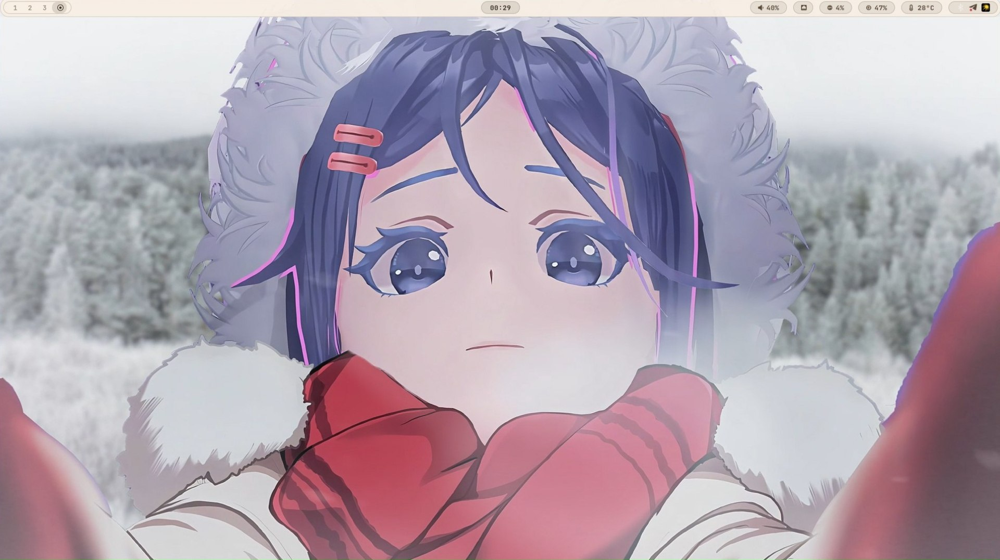

<h1 align="center">✦ Dotfiles ✦</h1>

    <i>These are my personal config files that I use.</i>

## Screenshots!
<a href="https://vsthemes.org/wallpapers/games/70438-christmas-mita-selfie.html" style="
    display: inline-block;
    padding: 10px 20px;
    background-color: #e2dfd9;
    color: #333;
    text-decoration: none;
    border-radius: 4px;
    font-family: sans-serif;
">wallpaper</a>

  

<a href="https://vsthemes.org/wallpapers/games/70438-christmas-mita-selfie.html">wallpaper</a>
